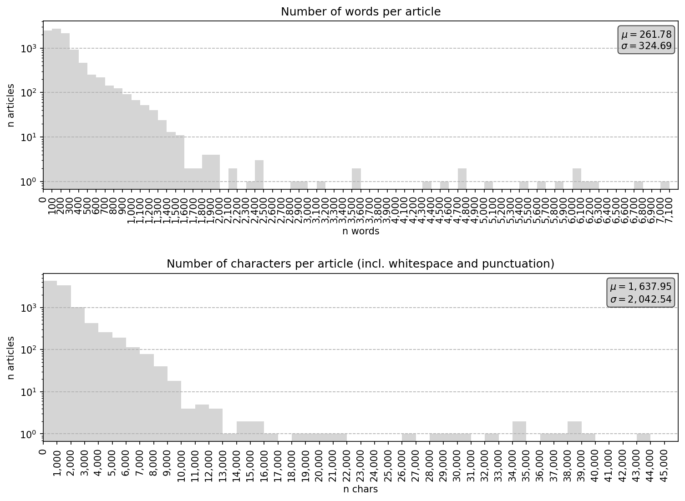

# Overview

This repository contains data, source code, and domain-adapted language models for
generating fake North Korean propaganda using machine learning.


# Installation

Use of this repository requires a conda environment. To install it, run the following
script:

```bash
bash ./create_env.sh
```

You can activate the environment using the following command:

```bash
conda activate ./env
```


# Models

*TBD*


# Data

## Distributions

The data set used to fine-tune the pretrained language models consists of 9,800
English newspaper articles published to [Rodong Sinmun](http://www.rodong.rep.kp/en/)
between January 2, 2018 and June 3, 2022.

The raw data consists of the following columns:

|Header   |Dtype  |Description                                   |
|:-------:|:-----:|:---------------------------------------------|
|``date`` |``str``|publish date in ISO format                    |
|``url``  |``str``|URL used to scrape article                    |
|``title``|``str``|verbatim article title                        |
|``body`` |``str``|verbatim article content with newlines removed|

The lengths of the articles are distributed as follows:



## Head

```python
>>> import pandas as pd
>>> csv = './data/raw/articles_2018-01-02_2022-06-03.csv'
>>> pd.read_csv(csv).head(10)
         date                                                url                                              title                                               body
0  2018-01-02  http://www.rodong.rep.kp/en/index.php?strPageI...  DPRK Will Dynamically Advance along Road Chose...  The service personnel and people of the DPRK a...
1  2018-01-02  http://www.rodong.rep.kp/en/index.php?strPageI...   Lunatic Action of Precipitating Self-Destruction  Soon after the UN fabrication of "sanctions re...
2  2018-01-02  http://www.rodong.rep.kp/en/index.php?strPageI...                 Celebration Performance of Workers  The Workers' Art Group of the Central Committe...
3  2018-01-02  http://www.rodong.rep.kp/en/index.php?strPageI...  Statues of Kim Il Sung, Kim Jong Il Erected at...  Colored statues of President Kim Il Sung and l...
4  2018-01-02  http://www.rodong.rep.kp/en/index.php?strPageI...  Floral Baskets to Statues of Kim Il Sung, Kim ...  Ya. T. Nobichenko, an internationalist soldier...
5  2018-01-02  http://www.rodong.rep.kp/en/index.php?strPageI...  Letter to Kim Jong Un from Central Committee o...  Respected Supreme Leader Kim Jong Un received ...
6  2018-01-02  http://www.rodong.rep.kp/en/index.php?strPageI...  Congratulatory Letter to Kim Jong Un from Chon...  Respected Supreme Leader Kim Jong Un received ...
7  2018-01-02  http://www.rodong.rep.kp/en/index.php?strPageI...  Kim Jong Un Greets Chongryon Chairman on New Year  Kim Jong Un, chairman of the State Affairs Com...
8  2018-01-02  http://www.rodong.rep.kp/en/index.php?strPageI...  Floral Basket to Kim Jong Un from Bereaved Fam...  Respected Supreme Leader Kim Jong Un received ...
9  2018-01-04  http://www.rodong.rep.kp/en/index.php?strPageI...  Japan Comes under Fire for Its Past Aggression...  Members of young people's organization in sout...
```

## Scrape new data

To scrape new articles, first activate the environment.

```bash
conda activate ./env
```

Then run the following command, substituting in actual dates as appropriate:

```bash
scrape --start_date {YYYY-MM-DD} --end_date {YYYY-MM-DD}
```

If either of ``--start_date`` or ``--end_date`` are unspecified, the following default
values will be used for the missing argument:

* ``--start_date`` : 2018-01-02
* ``--end_date``   : {today's date}

To see all options for customizing your new data collection, run the following command:

```bash
scrape --help
```
